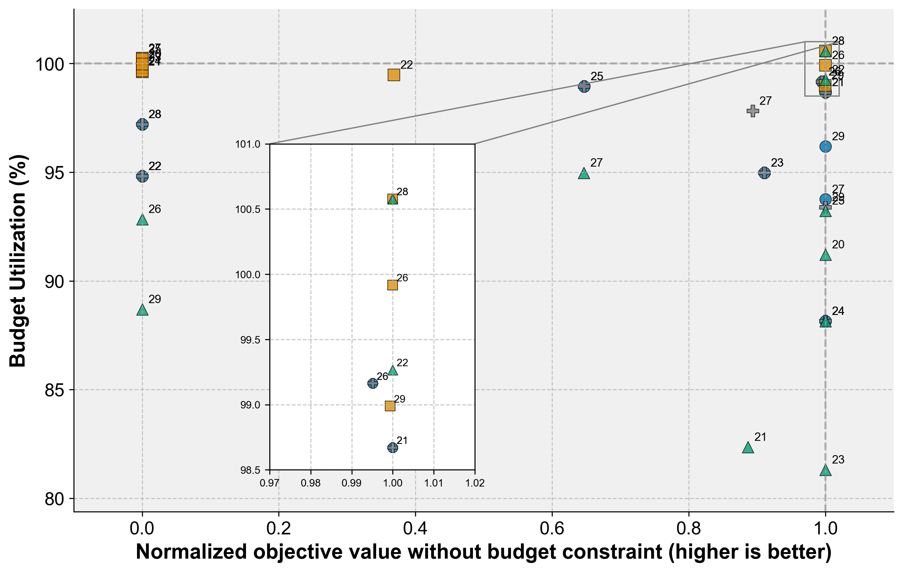

# Higher-Order Portfolio Optimization with QAOA -- Online Appendix

## Detailed portfolio optimization results with higher moments

## Variance of differences in mean-variance vs. higher order optimization cases

## Spectrum example with higher number of qubits

## Main files in this repo

1. The notebook generate_portfolio_experiments.ipynb generates random portfolio optimization problems based on the real stock data from yfinance.
2. Python file experiments.py contains the main experiments
3. Python file coskweness_cokurtosis.py has the functions to compute the higher-order moments
4. Python file portfolio_higher_moments_classical.py contains the classical baselines